# 🎂🍑 𝗦𝗨𝗠𝗔'𝗦 𝗔𝗟𝗟-𝗜𝗡-𝗖𝗔𝗞𝗘

This is the online documentation and tutorial for using the Suma's All-in-Cake App on the new Chaturbate app system.

&nbsp;

## 1. Current Features
The All-in-Cake app has the following features:
- 📃 Room subject and tags management
- 🛒 Goals and goal wars
- 🕵️ Secret/ticket/hidden/anti-bot shows
- 🎨 Color themes & Custom colors
-  👁️ Follow and unfollow announcements
- 💬 Welcome and follow thank-you messages
- 🤖 Anti-Bot Captcha, spam filter, banned words (also blocks messages with t𝐡e w𝗲ir∂ ᒪetter𝕤)
- 🗨️ Nicknames and whispering
-  💸 Multi-tipmenu with unlimited items
-  📢 Announcements with multiple lines
- 🥇 Top-3 tipper statistics and Top-5 all-time
- 🕒️ Configurable real-world time announcements
- 🥒 Toy level notifications
- ⏳️ Multipurpose timer with video panel support

&nbsp;

## 2. Settings
The settings are divided into sections by features, such as the tip menu, announcements, chat options, etc. Global and generic settings (such as theme and color options) are in the beginning of the settings list.

<b>🎨 Colors and themes</b>

### Color theme

**The app has a long list of built-in themes and presets.** If you don't want to have a hassle with HTML color codes, just pick a theme from the "Color theme (preset)" dropdown.

The color themes change everything from chat notice and announcement colors to the video panel background and text colors. By using a preset, you can just ignore all "custom color" settings.

### Custom colors

**You can ignore these settings if you have selected a color theme** from the earlier dropdown.  
The custom color settings are meant for users who want to completely change the colors.

The app allows customizing all colors and backgrounds. For background colors, you can use any valid HTML colors, or any valid CSS linear gradients. To make the job easier, there are online tools (such as [color pickers](https://htmlcolorcodes.com/color-picker/), and [cssgradient.io](https://cssgradient.io/)). You can also use color constants (e.g. black, white, red, blue, green, pink, magenta...)

### Color help

- [**» List of available color names**](../colors/)
- Custom color picker: https://htmlcolorcodes.com/color-picker/
- Gradient generator: https://cssgradient.io/

### Where the colors are shown:

- **Theme colors** are the colors used in regular chat notices, e.g. command responses and tip menus.

- **Announcement colors** are used in rotating announcements.

- **Panel image and progress bar** will be displayed in the video panel below your stream. It displays the current goal, or your defined welcome message. The panel shadow color is used behind bold texts on the panel, and should be different from the main panel text color.

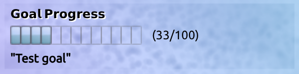

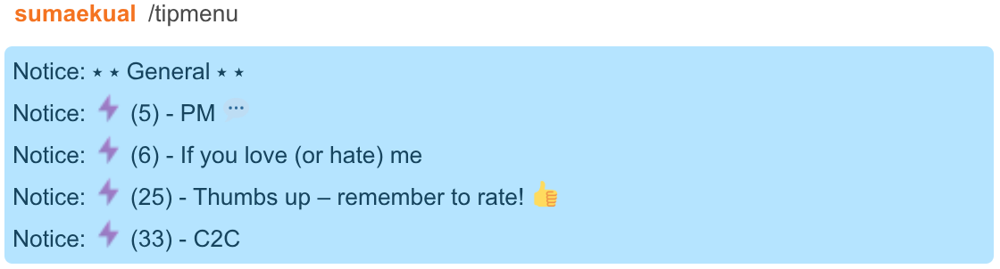

<b>📃 Room control (subject, messages)</b>

By default, the app will automatically control your room's subject. For this to work, you need to use the settings or the corresponding commands to set your subject and tags.

#### Subject and tags

Check the **enable subject & tags** checkbox if you want the app to automatically control your room's subject.

Use **room subject** to set your room's main title. Then write your hashtags to room tags. The app will automatically format your room's subject with the goal, the title, and the tags.

> [!TIP]
> - Use the command `/settags #tag1 #tag2 #tag3` to update tags without changing settings
> - Use the command `/settitle [title]` to update the subject without changing settings

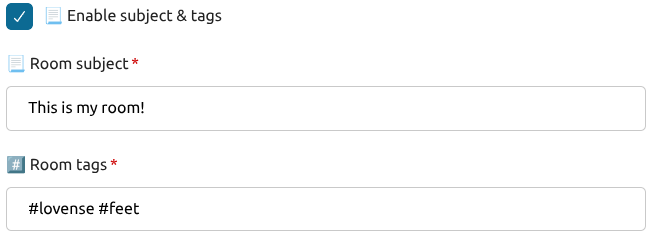

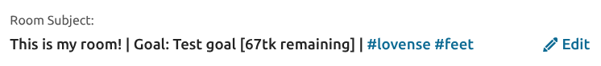

#### Welcome message

The **welcome message** is automatically sent to every user joining your room. Leave this field empty to disable the welcome message.

> [!TIP]
> **{USER}** is replaced with the user's name.

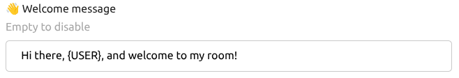

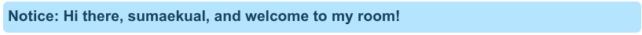

The **panel message** is displayed on your room's video panel when no goal is in progress.

<b>💬 Chat and Anti-Spam</b>

The app has a basic set of anti-spam and chat moderation features, including a **captcha**, a **chat restriction**, and **banned words**.

### Chat restriction

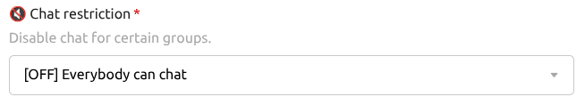

The **chat restriction** will change which users are allowed to chat in your room. For example, you can exclude gray users from the chat.

### Nicknames

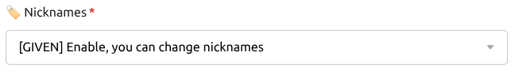

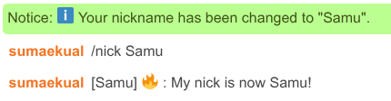

**Nicknames** are additional call names that will have next to their actual usernames. This setting will change who, if anyone, will be able to modify nicknames. Nicknames are changed using the command `/nickname`.

### Captcha

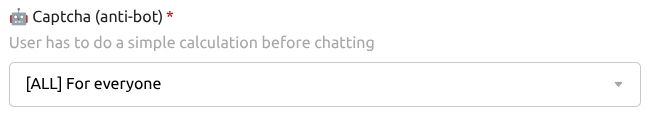

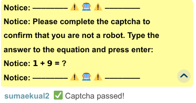

The **captcha** will require users to solve a simple mathematic equation before allowed to chat. This option will change who are required to solve the captcha.

### Chat filter

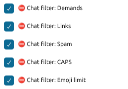

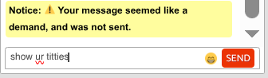

The **chat filter** options allow you to change how the spam filter will behave.

- Demands filter will delete messages like "show your X" or "I want to see Y"
- Link removal will remove URLs and emails.
- Spam removal will remove repeating words and letters and long numbers. 
- The emoji limit feature will only allow 5 emoji in a single message.

### Slow mode

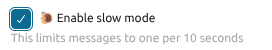

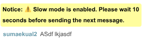

The **slow mode** will allow users to send only one message per 10 seconds. This way lots of users can chat simultaneously without a lot of spam.

### Banned words

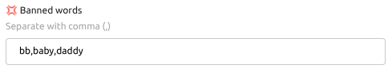

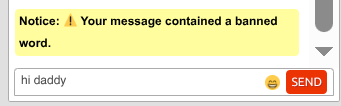

If you don't want to see certain words in the chat, you can add them to **banned words**. Messages containing any banned words will not be sent to the chat, and the user will receive a notification.

### Whispering

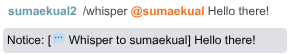

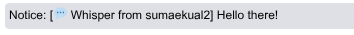

**Whispering** allows user to "whisper" to eachother in the chat. This is done using the command `/whisper @[user] [message]`.

**Chat icons** are emoji or emoticons that are shown next to users' names. You can set different icons to different user groups, and also give icons to any users with the command `/seticon @[user] [icon]`.

<b>🎨 </b>

## 3. Commands
Please see the link above for the full user guide.

| Command | Description |
| ----- | ----- |
| /tipmenu | Shows all of your menus |
| /whisper @[user] [message] | Send a "whisper" message to anyone (if enabled in settings) |
| /stats | Show Top-5 tippers today and all-time |
| **Nicknames** | ➖➖➖➖➖➖➖➖➖➖ |
| /nick [nickname] | Change your own nickname |
| /nick off | Remove your own nickname |
| /nick @[user] [nickname] | Change the nickname of a user |
| /nick @[user] off | Remove the nickname of a user |
| **Goals** | ➖➖➖➖➖➖➖➖➖➖ |
| /goal | **See help for the command**
| /goal add [tokens] [text] | Add a goal. If there is a goal in progress, the new goal will be added to the **goal queue**. |
| /goal set [tokens] [text] | Change the current goal (goal queue is not affected) |
| /goal setprogress [tokens] | Manually set the progress of a goal |
| /goal list | Show all upcoming goals of the goal queue |
| /goal repeat [n] | Repeats the current goal *n* times into the queue |
| /goal remove [i] | Removes the *i*th goal from the queue (use /goal list to see them all) |
| /goal remove all | Removes **all** goals from the queue |
| /goal skip | Skips the current goal and moves to the next from the queue (if it exists) |
| /goalwar create [(tokens) (text)] [(tokens) (text)] | Creates a **goal war** / **goal vote** where users can tip to vote for their desired option (the tip option text shows in their tip menu) |
| /goalwar remove | Removes the current goal war |
| /goalwar info | Shows information about the current goal war |
| **Secret shows** | ➖➖➖➖➖➖➖➖➖➖ |
| /secret add @[user] | Invite user to secret show |
| /secret add @[user] [tokens] | Add an user to a pay-per-minute show with the given token amount |
| /secret remove @[user] | Remove a user from the secret show |
| /secret clear | Remove **all users** from the show |
| /secret list | View a list of users watching the show |
| **Toy Profiles** | ➖➖➖➖➖➖➖➖➖➖ |
| /toy list | List all saved toy profiles |
| /toy list [profile] | List a specific profile |
| /toy add [profile] [toy name] | Add a toy profile ('profile' cannot contain spaces) |
| /toy remove [profile] | Remove a toy profile
| /toy seticon [profile] [icon] | Set an icon for a toyp profile (set to 'none' to remove icon) |
| /toy clear [profile] | Remove all levels from toy profile |
| /toy setlevel [profile] [range] [description, icon:"..."] | Set a level for the toy and a tip range. For example: **/toy setlevel lush 1-10 Small vibrations icon:"💕"** |
| /toy removelevel [profile] [range] | Remove a level range from a toy profile. For example: **/toy removelevel lush 1-10** |
| /toy enable [profile] | **Activate** a toy profile (to let viewers know that you're using this toy) |
| /toy disable [profile] | **Deactivate** a toy profile |
| /toy clear | Deactive all toy profiles |
| /toy export | Print out your saved toy profiles to be saved and used somewhere later |
| /toy import [json] | Import a previously exported toy profile collection. 'json' is the text that **/toy export** prints to your chat.
| **Timer** | ➖➖➖➖➖➖➖➖➖➖ |
| ℹ️ | *The timer will count down a given time. For example, if you want to show a part of your body for 5 minutes, set a timer for 5 minutes! The timer is displayed in the panel below your stream.* |
| /timer | Get **help** for the timer command |
| /timer panel | Change whether to show the timer in the panel or not |
| /timer start [hh:mm:ss] [timer text] | Start a timer of **hh** hours, **mm** minutes and **ss** seconds. For example, **/timer start 00:05:00** sets a timer of 5 minutes. |
| /timer pause | Pause the timer |
| /timer clear | Remove the timer and return to normal |

🤍

**More help with the commands:**

https://suma.webcams.click/all-in-cake/

🤍

### 4️⃣ Permissions
- **Broadcaster and moderators (=red) have full access to commands**
- More complex permissions will be added later; you can always request a custom app for your needs! ( @sumaekual )

### 5️⃣ Changelog

💡 Release 0.X.Y (May 2026)
- Update settings to use the new fieldsets for clarity
- Improve descriptions of some settings
- Improve description and command help of the app

💡 Release 0.10.1 (August 2023)
- Attempt to fix some regularly thrown errors
- Fix an error where disabling the tip menu announcements was not possible by setting the interval to 0

💡 Release 0.10.0 (June 2023)
- Fix an error being thrown when trying to start or stop a hidden show while the broadcast is online

💡 Release 0.9.0–0.9.1 (Feb 2023)
- Added a demand filter
- Improvements to notice headers
- Improvements to $kv cleanup
- Bug fixes
    - The caps filter no longer filters out emoticons

💡 Release 0.8.2 (Aug 19th, 2022)
- Removed the "this command is not recognized" message, since other apps also use slash command, thus causing unnecessary notices
- Minor improvements and fixes

💡 Release 0.8.0–0.8.1 (July 28th–Aug 2nd, 2022)
- Improvements to spam filter, new filtering based on messages "co𝕟𝕥aining t𝐡e w𝗲ir∂ ᒪetter𝕤"
- The command handling has been reverted back to normal, since CB recently fixed the chat message event issue
- Added GOAL WARS. Use /goalwar to create a goal war/vote! (The guide will be updated on this later)
- Fixes to room subject & tag handling with settings
- Other minor improvements and fixes

💡 Release 0.7.0–0.7.2 (July 7th, 2022)
- The custom theme options have been moved to the end of the settings for clarity
- Added a multipurpose timer
- Added multiline support for announcements.
      [ ! ] IMPORTANT:
      Previously, the vertical bar character ("|") was used for adding multiple
      announcements per input field. THIS HAS BEEEN CHANGED to the paragraph
      symbol ("§"), as the vertical bar ("|") is now used for splitting announcements
      into multiple lines.